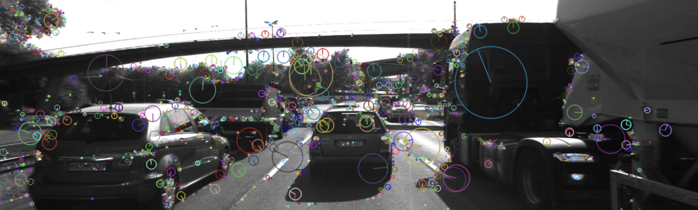

# SFND 2D Feature Tracking

The idea of the camera course is to build a collision detection system - that's the overall goal for the Final Project. As a preparation for this, you will now build the feature tracking part and test various detector / descriptor combinations to see which ones perform best. This mid-term project consists of four parts:

* First, you will focus on loading images, setting up data structures and putting everything into a ring buffer to optimize memory load. 
* Then, you will integrate several keypoint detectors such as HARRIS, FAST, BRISK and SIFT and compare them with regard to number of keypoints and speed. 
* In the next part, you will then focus on descriptor extraction and matching using brute force and also the FLANN approach we discussed in the previous lesson. 
* In the last part, once the code framework is complete, you will test the various algorithms in different combinations and compare them with regard to some performance measures. 

See the classroom instruction and code comments for more details on each of these parts. Once you are finished with this project, the keypoint matching part will be set up and you can proceed to the next lesson, where the focus is on integrating Lidar points and on object detection using deep-learning. 

## Dependencies for Running Locally
* cmake >= 2.8
  * All OSes: [click here for installation instructions](https://cmake.org/install/)
* make >= 4.1 (Linux, Mac), 3.81 (Windows)
  * Linux: make is installed by default on most Linux distros
  * Mac: [install Xcode command line tools to get make](https://developer.apple.com/xcode/features/)
  * Windows: [Click here for installation instructions](http://gnuwin32.sourceforge.net/packages/make.htm)
* OpenCV >= 4.1
  * This must be compiled from source using the `-D OPENCV_ENABLE_NONFREE=ON` cmake flag for testing the SIFT and SURF detectors.
  * The OpenCV 4.1.0 source code can be found [here](https://github.com/opencv/opencv/tree/4.1.0)
* gcc/g++ >= 5.4
  * Linux: gcc / g++ is installed by default on most Linux distros
  * Mac: same deal as make - [install Xcode command line tools](https://developer.apple.com/xcode/features/)
  * Windows: recommend using [MinGW](http://www.mingw.org/)

## Basic Build Instructions

1. Clone this repo.
2. Make a build directory in the top level directory: `mkdir build && cd build`
3. Compile: `cmake .. && make`
4. Run it: `./2D_feature_tracking`.

## REPORT
* Data Buffer:
  * MP.1 Data Buffer Optimization:
        vector<template T> STL container allows to remove elements from vector specified with an iterator. Hence, if size of vector is greater than 1, then we should remove the first element and push_back the new element.

* Keypoints:
  * MP.2 Keypoint Detection:
        OpenCV has majority of the detectors/descriptors implemented. Every detector implements "FeatureDetector" interface in their own namespaces. To create a detector, create() function needs to be called which return a shared pointer to "cv::FeatureDetector" (the object gets destructed once it gets out of scope - RAII). The namespace is chosen based on the string parameter that specifies detector type.
        For "Harris" detector, I have used the implementation from Lesson 4 quiz. Hence, it has its own execution path; detKeypointsModern() will call detKeypointsHarris() if type "HARRIS" is specified. As soon as detKeypointsHarris() returns, detKeypointsModern() will return as well.

  * MP.3 Keypoint Removal
        The preceding vehicle is expected to be within rectangle of (535, 180, 180, 150). The class cv::Rect has a member function "bool contains(cv::Point)". For every keypoint we have detected, we have to check whether rectangle contains that point. If yes, we add the point to a new list. Creating a new list and pushing inliers is much cheaper than just removing element from list (easy to read, maintain, and might be faster if erase() is not O(1))

* Descriptors:
  * MP.4 Keypoint Descriptors:
        Similar to detectors, we can use create() function to create a descriptor. Based on the specified type via a string parameter, we can call create() from appropriate namespace.
